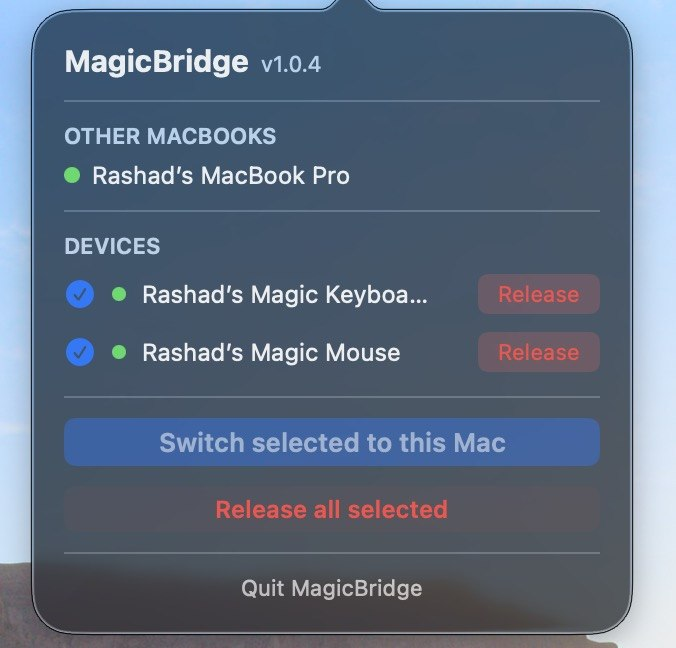

# MagicBridge

A macOS menu bar app that lets you **share a Magic Trackpad, Magic Mouse, or Magic Keyboard across multiple MacBooks** — one click and the device switches to whichever Mac you're sitting at.



## Features

- **Menu Bar App** — Runs silently in the menu bar, no dock icon
- **Auto-Discovery** — Finds other MacBooks running MagicBridge on your local network via mDNS/Bonjour, with a hello heartbeat protocol to stay in sync after sleep or network changes
- **One-Click Handoff** — Connect to any device with a single click; MagicBridge automatically asks the other Mac to release it first
- **Graceful Fallback** — If a peer doesn't respond in time, MagicBridge connects anyway and tells you
- **Switch All** — Move every enabled device to this Mac in one action
- **Release All** — Disconnect all devices from this Mac so another can pick them up
- **Per-Device Enable/Disable** — Toggle individual devices on or off; your choices are remembered across restarts
- **Launch at Login** — Optional auto-start so your devices are always ready when you log in
- **No System Dialog** — Device switching happens silently with no Bluetooth confirmation prompts

## How It Works

Each Mac running MagicBridge does five things simultaneously:

1. **Bluetooth monitoring** — Listens for IOBluetooth connect/disconnect events for instant UI updates; a 60-second safety poll catches anything missed
2. **mDNS advertising** — Publishes a `_magicbridge._tcp` Bonjour record so other Macs can find it
3. **Hello heartbeats** — Sends a `hello` message to each known peer every 15 seconds (and immediately on wake from sleep); peers are evicted within 45 seconds if they go offline
4. **Release protocol** — When you click Connect or Switch All, MagicBridge sends a `release_devices` message over TCP (port 57842) to every peer; the peer disconnects the devices and replies `devices_released` before the local Mac connects
5. **Silent pairing** — After a device is released, MagicBridge uses `IOBluetoothDevicePair` with an auto-confirming delegate to re-establish the connection without showing any system dialog
6. **Device persistence** — Enabled devices are stored in UserDefaults so the list survives app restarts even when devices are off or out of range

## Requirements

- macOS 13.0 or later
- Two or more Bluetooth-enabled Macs on the same local network
- Magic Trackpad, Magic Mouse, or Magic Keyboard

## Installation

1. Download `MagicBridge.zip` from the [latest release](../../releases/latest)
2. Unzip and drag `MagicBridge.app` to your **Applications** folder
3. Launch it from Applications

> **First launch only:** macOS will block the app because it is not notarized.
> Open **System Settings → Privacy & Security**, scroll down, and click **Open Anyway**.
> You will also be prompted to grant Bluetooth access — click **Allow**.

On first launch you'll be asked whether to enable **Launch at Login**. You can change this later by quitting and relaunching the app.

## Building from Source

### Prerequisites

- Xcode 15+
- XcodeGen (`brew install xcodegen`)

### Build

```bash
# Install dependencies (xcodegen)
make deps

# Build and install directly to /Applications (no code signing required)
make install

# Release build — produces MagicBridge.app and MagicBridge.zip (requires a code signing identity)
make release
```

`make install` builds a debug binary, copies it to `/Applications/MagicBridge.app`, strips quarantine, and launches it immediately. `make release` produces a signed `MagicBridge.app` and `MagicBridge.zip` in the project root.

## Usage

1. Click the menu bar icon to open the popover
2. **Other MacBooks** — Shows peers discovered on your network (green dot = reachable)
3. **Devices** — Lists all paired Magic devices
   - Click the circle to enable/disable a device (persisted across restarts)
   - Click **Connect** to claim the device on this Mac (peers are asked to release first)
   - Click **Release** to disconnect the device so another Mac can pick it up
4. **Switch selected to this MacBook** — Claim all enabled devices at once
5. **Release all selected** — Release all currently-connected enabled devices
