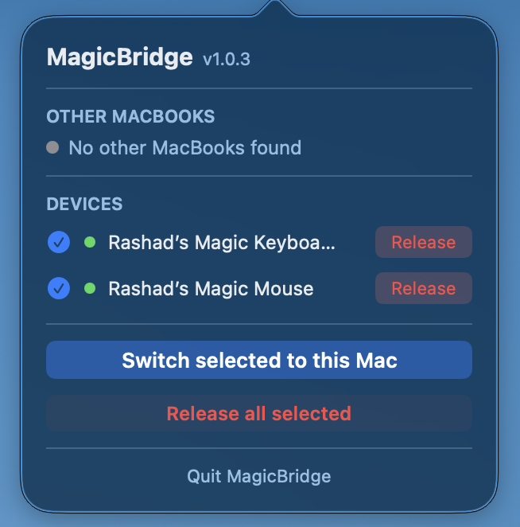

# MagicBridge

A macOS menu bar application that enables **Magic Mouse**, **Magic Keyboard**, and **Magic Trackpad** multi-device switching between MacBooks using Apple's Multitouch protocol over Bluetooth.



## Features

- **Menu Bar App** - Runs silently in the menu bar, no dock icon
- **Auto-Discovery** - Automatically finds other MacBooks on the local network via mDNS/Bonjour
- **One-Click Connect** - Connect to Magic devices with a single click
- **Device Management** - Enable/disable individual devices (persisted in UserDefaults)
- **Switch All** - Connect to all enabled devices (requests other MacBooks to release first)
- **Release All** - Disconnect all devices connected to this Mac

## How It Works

MagicBridge enables sharing Magic devices across multiple MacBooks:

1. **Bluetooth Discovery** - Uses `blueutil` to scan for paired Magic devices (Trackpad, Mouse, Keyboard)
2. **Device Connection** - Pairs and connects to the selected device via Bluetooth HID
3. **Peer Discovery** - Discovers other MacBooks running MagicBridge via mDNS/Bonjour on port 57842
4. **Device Handoff** - When you connect to a device while another Mac has devices connected, it requests that Mac to release first, then connects locally

The menu bar icon reflects whether devices are connected to **this Mac** (active) or to **another Mac** (inactive).

## Requirements

- macOS 13.0 or later
- Bluetooth-enabled Mac
- Magic Trackpad, Magic Mouse, or Magic Keyboard (1st or 2nd generation)
- `blueutil` (included in app bundle)

## Installation

1. Download `MagicBridge.zip` from the [latest release](../../releases/latest)
2. Unzip and drag `MagicBridge.app` to your **Applications** folder
3. Launch it from Applications

> **First launch only:** macOS will block the app because it is not from the App Store.
> Open **System Settings → Privacy & Security**, scroll down, and click **Open Anyway**.
> You will also be prompted to grant Bluetooth access — click **Allow**.

The app appears in the menu bar with no dock icon.

## Building from Source

### Prerequisites

- Xcode 15+
- XcodeGen (install via `brew install xcodegen`)

### Build

```bash
# Debug build
make build

# Release build
make release
```

The built app will be in `MagicBridge.app`

## Usage

1. Click the menu bar icon to open the popover
2. **Other MacBooks** - Shows other MacBooks running MagicBridge on your network (discovered via mDNS)
3. **Devices** - Lists available Magic Trackpads/Mice/Keyboards
   - Click the toggle to enable/disable a device
   - Click the connect button to connect (if another Mac has devices, it will request release first)
4. **Switch All** - Connect to all enabled devices
5. **Release All** - Disconnect all devices connected to this Mac
